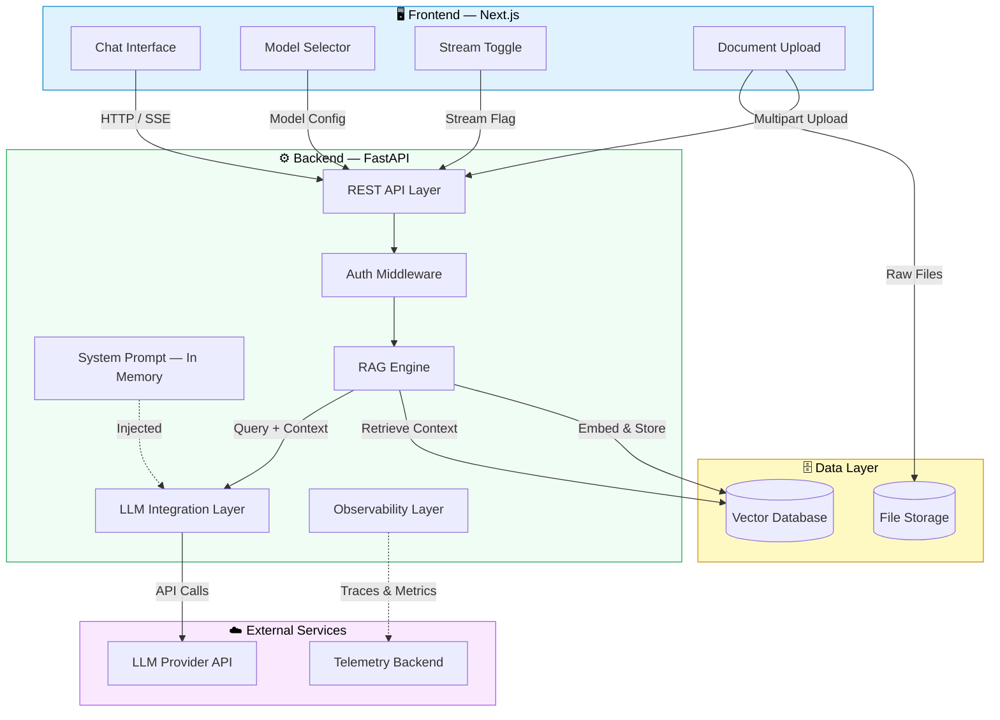
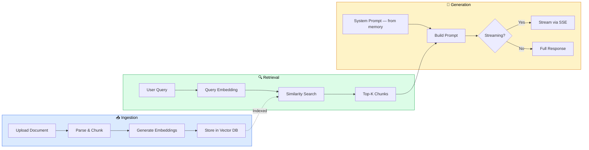
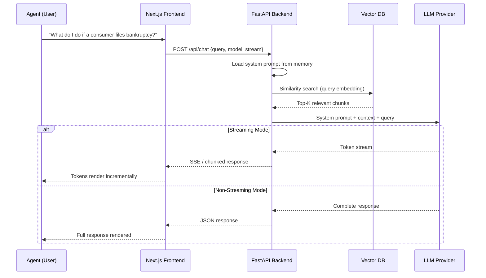
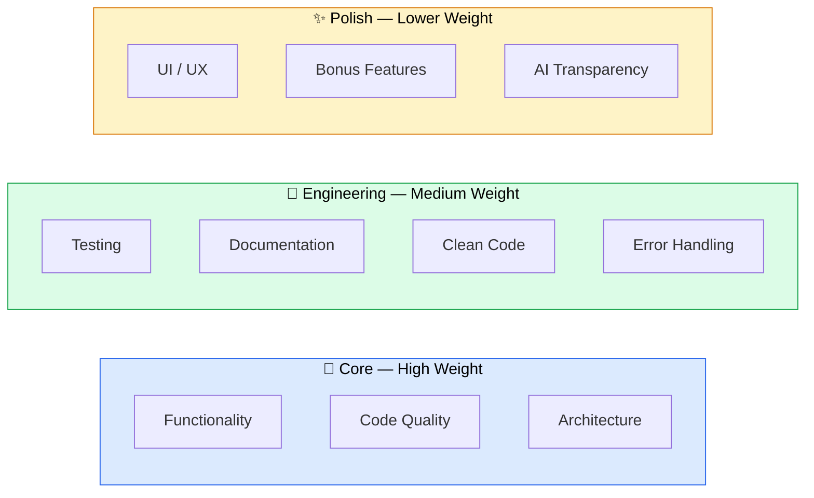

# Full-Stack AI Chat Application — Take-Home Assignment

## Overview

Build a **production-ready AI-powered chat application** for a **debt collection agent assistant**. The app uses a Retrieval-Augmented Generation (RAG) pipeline to help agents quickly look up compliance rules, call scripts, account data, and terminology — grounded in real reference documents.

Users should be able to upload documents, ask questions against them, choose between different LLM models, and toggle between streaming and non-streaming response modes — all through a clean, responsive UI.

This assignment evaluates your ability to design and implement a full-stack system that integrates modern AI/LLM tooling with solid software engineering practices.

---

## Domain Context — Debt Collection Agent Assistant

The chat assistant is designed for **debt collection agents** who need quick, accurate answers while on calls or reviewing accounts. Think of it as an internal compliance copilot.

### What the agent should be able to ask

- "What is the Mini-Miranda disclosure and when do I need to say it?"
- "Can I call a consumer at 7:30 AM?"
- "What do I do if a consumer says they filed for bankruptcy?"
- "What's the status on account ACC-003?"
- "What script should I use when a consumer disputes a debt?"
- "What does SCRA_HOLD mean?"

### System Prompt (store in memory)

The system prompt for the LLM should be stored **in memory** on the backend (not hardcoded per request from the frontend). The candidate should design a simple mechanism where:

- A default system prompt is loaded at server startup.
- The prompt instructs the LLM to behave as a **debt collection compliance assistant** — helpful, accurate, and always grounding answers in the retrieved context.
- The prompt should tell the model to cite which document the answer came from when possible.
- **Bonus**: Allow the system prompt to be updated at runtime via an API endpoint (e.g., `PUT /api/config/system-prompt`), without restarting the server.

Example system prompt (candidates may refine this):

```
You are a compliance assistant for debt collection agents. Answer questions
using ONLY the provided context from company documents. If the context does
not contain the answer, say so — do not make up information.

When answering, cite which document the information came from.
Be concise, professional, and accurate. If a question involves a specific
account, provide the relevant details from the account data.
```

---

## Reference Data for RAG

The following files are provided in the `rag-reference-data/` folder of this repository. These are the **seed documents** that must be ingested into the vector database to demonstrate the RAG pipeline.

| File | Description | Purpose |
|------|-------------|---------|
| `fdcpa_quick_reference.md` | FDCPA rules summary — communication rules, consumer rights, prohibited conduct, penalties | Compliance Q&A |
| `call_scripts.md` | Standard call scripts — opening, disputes, cease-and-desist, negotiation, voicemail | Script lookup |
| `sample_accounts.csv` | 8 sample debtor accounts with varied statuses (active, disputed, bankruptcy, SCRA, etc.) | Account lookup |
| `glossary.md` | Account statuses, regulatory terms, and disposition codes | Terminology lookup |

> **These files are intentionally minimal.** The goal is to prove that the RAG pipeline works end-to-end — ingestion, retrieval, and grounded generation — not to build an exhaustive knowledge base.

### Expected RAG Behavior

After ingesting these documents, the system should be able to answer queries like:

| Query | Expected Source | Expected Behavior |
|-------|----------------|-------------------|
| "What are the permitted calling hours?" | `fdcpa_quick_reference.md` | Returns 8 AM – 9 PM rule with context |
| "What script do I use for voicemail?" | `call_scripts.md` | Returns the limited-content message script |
| "What is the status of account ACC-007?" | `sample_accounts.csv` | Returns bankruptcy status with note |
| "What does CEASE_DESIST mean?" | `glossary.md` | Returns the status definition |
| "Can I contact David Kim directly?" | `sample_accounts.csv` | Returns cease-and-desist status — should advise no |
| "What happens if I don't give the Mini-Miranda?" | `fdcpa_quick_reference.md` | Returns federal violation + penalty info |
| "Tell me about HIPAA rules" | None | Should state the answer is not in the provided documents |

---

## High-Level Architecture



---

## RAG Pipeline Flow



---

## Request Lifecycle



---

## Tech Stack (Required)

| Layer       | Technology                                      |
| ----------- | ----------------------------------------------- |
| Frontend    | **Next.js** (App Router preferred) or **React** |
| Backend     | **Python FastAPI**                               |
| Vector DB   | Any (e.g., ChromaDB, Qdrant, Weaviate, Pinecone, Milvus, pgvector) |
| LLM         | Any provider (OpenAI, Anthropic, Mistral, Groq, Ollama, etc.)      |

---

## Mandatory Features

### 1. Chat Interface

- A conversational UI where agents can send questions and receive AI-generated answers.
- Display conversation history within the session.
- Clearly distinguish between user messages and AI responses.
- Handle loading/thinking states gracefully.

### 2. RAG Pipeline

Build a complete Retrieval-Augmented Generation pipeline:

- **Ingestion** — Accept the provided reference documents (and any additional uploads), chunk them, generate embeddings, and store in the vector database.
- **Retrieval** — On each query, perform similarity search and retrieve the most relevant chunks.
- **Generation** — Pass the system prompt (from memory) + retrieved context + user query to the selected LLM.

The system should behave meaningfully differently when documents have been ingested vs. when the vector store is empty. Make this distinction clear in the UI or response.

### 3. System Prompt Management

- The system prompt must be stored **in memory** on the backend (e.g., a Python variable, a singleton config object, or equivalent).
- It should NOT be sent from the frontend on each request.
- The backend injects the system prompt into every LLM call automatically.
- **Bonus**: Expose a `PUT /api/config/system-prompt` endpoint to update the prompt at runtime without restarting the server.

### 4. Model Selection

- Provide a UI control that lets the user switch between **at least two LLM models**:
  - One **"thinking" model** (e.g., o1, Claude 3.5 Sonnet, DeepSeek-R1, or any model with chain-of-thought / extended thinking capabilities).
  - One **"non-thinking" / standard model** (e.g., GPT-4o-mini, Claude Haiku, Mistral Small, etc.).
- The switch should take effect immediately on the next query.

### 5. Streaming Toggle

- Provide a UI control to switch between **streaming** and **non-streaming** response modes.
- **Streaming**: Tokens appear incrementally (via SSE, WebSockets, or equivalent).
- **Non-streaming**: Full response appears at once.
- The toggle should take effect on the next query.

---

## Mandatory Engineering Requirements

### Linting

- Linters configured for **both** frontend and backend.
- Frontend: ESLint (e.g., `next/core-web-vitals`, `prettier`).
- Backend: `ruff`, `flake8`, or `pylint`.
- Lint commands in project scripts (`npm run lint`, `make lint`).
- Codebase **must pass linting without errors** at submission.

### Unit Tests

- Meaningful tests for **both** frontend and backend.
- Backend (`pytest`): RAG retrieval logic, API endpoint contracts, utility functions.
- Frontend (Jest / Vitest / RTL): At least 1–2 key components or hooks.
- Test commands in project scripts (`npm test`, `pytest`).

### Documentation

`README.md` at the root with:

- **Project overview** — what it does.
- **Architecture** — how the pieces fit together (diagram is a plus).
- **Setup instructions** — step-by-step to run locally.
- **API documentation** — all endpoints with request/response formats (Swagger counts).
- **Design decisions** — why you chose your vector DB, LLM, chunking strategy, etc.
- **Known limitations** — what's incomplete or you'd improve.

---

## Clean Code Principles

These are **mandatory**, not guidelines.

### Code Organization

- Logical project layout grouped by feature or layer.
- Separation of concerns — route handlers should NOT contain business logic.
- Single Responsibility — each function/class does one thing well.

### Naming & Readability

- Descriptive naming that reveals intent (`get_relevant_documents` not `get_docs`).
- Consistent conventions (`snake_case` Python, `camelCase` JS/TS).
- Comments explain **why**, not **what**.

### Engineering Hygiene

- No dead code, unused imports, or commented-out blocks.
- No hardcoded values — use env vars and config files. Include `.env.example`.
- DRY — extract shared logic.
- Proper error handling — no bare `except:`, no swallowed errors.
- Type hints on all Python function signatures. TypeScript on frontend is a plus.

### Git Practices

- Atomic commits with clear messages. We **will** review commit history.
- Conventional commits preferred (e.g., `feat:`, `fix:`, `docs:`).
- No secrets in history. `.env` in `.gitignore`.

---

## Section-Wise Setup Expectations

### Expected Project Structure

```
project-root/
├── frontend/                # Next.js app
│   ├── src/
│   │   ├── app/             # Pages & routes
│   │   ├── components/      # UI components
│   │   ├── hooks/           # Custom hooks
│   │   ├── lib/             # API client, utils
│   │   └── types/           # TypeScript interfaces
│   ├── __tests__/
│   ├── .env.example
│   └── package.json
│
├── backend/                 # FastAPI app
│   ├── app/
│   │   ├── api/             # Route handlers
│   │   ├── core/            # Config, prompt store, dependencies
│   │   ├── models/          # Pydantic schemas
│   │   ├── services/        # RAG, LLM, vector store logic
│   │   └── utils/           # Helpers
│   ├── tests/
│   ├── .env.example
│   └── pyproject.toml
│
├── rag-reference-data/      # Seed documents for RAG
│   ├── fdcpa_quick_reference.md
│   ├── call_scripts.md
│   ├── sample_accounts.csv
│   └── glossary.md
│
├── .github/                 # CI/CD (bonus)
├── docker-compose.yml       # (optional)
├── AI_USAGE.md              # (if AI tools used)
└── README.md
```

### 1. Environment Setup

```bash
git clone <repo-url> && cd <project-root>
cp backend/.env.example backend/.env
cp frontend/.env.example frontend/.env
# Fill in API keys and config
```

### 2. Backend

```bash
cd backend
python -m venv venv && source venv/bin/activate
pip install -r requirements.txt
uvicorn app.main:app --reload --port 8000
# Swagger: http://localhost:8000/docs
```

### 3. Frontend

```bash
cd frontend
npm install && npm run dev
# App: http://localhost:3000
```

### 4. Ingest Seed Data

```bash
# Via script or API — ingest the rag-reference-data/ files
python scripts/ingest.py          # or
curl -X POST http://localhost:8000/api/ingest -F "file=@rag-reference-data/fdcpa_quick_reference.md"
```

### 5. Linting & Tests

```bash
# Backend
cd backend && ruff check .
pytest

# Frontend
cd frontend && npm run lint
npm test
```

---

## AI Agent / AI Tool Disclosure

> **Mandatory if you use AI assistance.**

If you used any AI agent or tool (GitHub Copilot, Claude Code, Cursor, Aider, ChatGPT, etc.), include an `AI_USAGE.md` file documenting:

| Field | What to include |
|-------|----------------|
| **Tools used** | Name and version of every AI tool. |
| **Scope** | Which parts of the codebase were AI-generated or AI-assisted. Be specific. |
| **Prompts & skills** | Key prompts or config files used. Save as `.md` files in `docs/ai/` and reference them. |
| **Human review** | How you reviewed, tested, and validated AI output. |
| **Understanding** | Be prepared to explain any AI-generated code in a follow-up discussion. |

> Using AI tools is perfectly acceptable. We care about **transparency** and **understanding**, not whether you used them.

---

## Bonus Features

Implement any that demonstrate your skills. Quality over quantity.

### 1. Authentication & Authorization on RAG Layer

- Protect RAG endpoints behind auth.
- Scope documents per user (User A can't query User B's docs).

### 2. Login / Logout

- User auth (JWT, session, OAuth — your choice).
- Appropriate UI states for logged-in vs. logged-out.

### 3. Document Upload Interface

- UI for uploading documents (drag-and-drop, file picker, or both).
- Upload progress and confirmation.
- Optionally list ingested documents with metadata.

### 4. CI/CD Pipeline

- GitHub Actions or similar running linting + tests.
- Include the pipeline config in the repo.

### 5. Hosted URL

- Deploy to a public URL. Include it in the README.

### 6. Observability Layer

Instrument the backend with an observability stack:

- **Tracing** — Trace the full lifecycle of a request: API → RAG retrieval → LLM call → response. Use OpenTelemetry, Langfuse, LangSmith, or any provider.
- **Metrics** — Track at minimum: request latency, LLM token usage, retrieval hit/miss rates, error counts.
- **Logging** — Structured logging (JSON format preferred) with correlation IDs tying logs to traces.

The goal is to be able to answer: *"Why was this response slow?"* or *"Why did the model hallucinate here?"* from the telemetry data.

> You do NOT need a production monitoring stack. A local Jaeger/Zipkin instance, a Langfuse self-hosted setup, or even console-exported traces with clear correlation IDs are sufficient.

---

## Evaluation Criteria



| Criteria                | What We Look For                                                                 | Weight |
| ----------------------- | -------------------------------------------------------------------------------- | ------ |
| **Functionality**       | All mandatory features work. RAG pipeline is functional end-to-end with the provided seed data. | High   |
| **Code Quality**        | Clean, readable, well-organized. Follows the clean code principles above.         | High   |
| **Architecture**        | Separation of concerns. Logical structure. Scalable patterns.                     | High   |
| **Testing**             | Meaningful tests covering important logic — not just smoke tests.                 | Medium |
| **Documentation**       | Another developer can clone and run with minimal friction.                         | Medium |
| **Clean Code**          | Types, naming, DRY, git history, error handling.                                  | Medium |
| **Error Handling**      | Graceful failures (LLM errors, empty store, bad uploads).                         | Medium |
| **UI/UX**              | Intuitive, responsive, not broken. Doesn't need to be award-winning.              | Low    |
| **Bonus Features**      | Quality over quantity. Well-implemented bonuses > half-finished everything.        | Low    |
| **AI Transparency**     | Honest disclosure and demonstrated understanding if AI tools were used.            | —      |

---

## Submission Guidelines

1. Push to a **public or private GitHub repository**.
2. `README.md` with everything needed to run the project.
3. `rag-reference-data/` folder with the provided seed documents included.
4. `AI_USAGE.md` if AI tools were used (with supporting `.md` files in `docs/ai/`).
5. If private repo, grant access to: `[ADD REVIEWER GITHUB HANDLES HERE]`.
6. If hosted, verify the URL works before submitting.

> **Note:** If your solution requires paid API keys, include a `.env.example` with placeholders. Do NOT commit secrets.

---

## FAQ

**Can I use additional libraries or frameworks?**
Yes. Be prepared to explain your choices.

**Can I use LangChain, LlamaIndex, or similar?**
Yes, but demonstrate you understand what it's doing. Over-abstraction with no understanding is viewed less favorably.

**Do I need to support multiple file types?**
At minimum, handle the provided `.md` and `.csv` files. Supporting PDF or DOCX is a bonus.

**What if I can't finish everything?**
Focus on mandatory features first. Document what you'd do next in "Known Limitations."

**Is using AI tools penalized?**
No. Undisclosed AI usage that surfaces during review will reflect poorly. Transparency is what matters.

---

Good luck. We're looking forward to seeing what you build.
