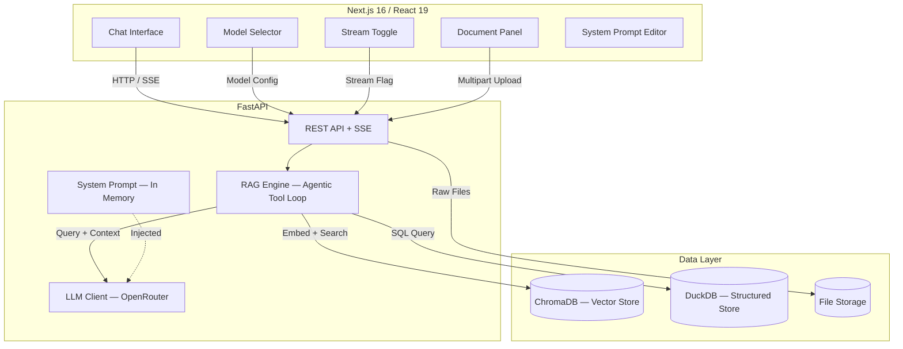

# Debt Collection Compliance Assistant

An AI-powered chat application that helps debt collection agents quickly look up compliance rules, call scripts, account data, and terminology. Uses a Retrieval-Augmented Generation (RAG) pipeline to ground LLM answers in uploaded reference documents.

## Architecture



### Key Design: Agentic Tool-Calling RAG

Rather than a static retrieve-then-generate pipeline, the RAG engine uses an **agentic tool-calling loop**:

1. The LLM receives the user query along with dynamically-bound tools based on what data is available.
2. If vector documents are ingested, a `vector_search` tool is exposed. If CSV data is loaded, a `sql_query` tool is exposed.
3. The LLM decides which tools to call (and in what order) to answer the query. This allows multi-step reasoning — e.g., first querying structured data for account info, then searching compliance docs for relevant rules.
4. Tool results are fed back to the LLM, which may call more tools or produce a final answer.
5. A safety cap of 10 iterations prevents runaway loops.

This approach handles complex cross-data queries that a simple hybrid search cannot.

---

## Setup Instructions

### Prerequisites

- Python 3.11+
- Node.js 18+
- An [OpenRouter](https://openrouter.ai/) API key

### Backend

```bash
cd backend
python -m venv venv && source venv/bin/activate
pip install -r requirements.txt
cp .env.example .env
# Edit .env and set OPENROUTER_API_KEY
uvicorn app.main:app --reload --port 8000
```

Swagger docs: http://localhost:8000/docs

### Frontend

```bash
cd frontend
npm install
cp .env.example .env.local
# Default NEXT_PUBLIC_API_URL=http://localhost:8000
npm run dev
```

App: http://localhost:3000

### Ingest Seed Data

Upload the reference documents from `rag-reference-data/` through the Document Panel in the UI, or via the API:

```bash
for f in rag-reference-data/*; do
  curl -X POST http://localhost:8000/api/documents -F "file=@$f"
done
```

### Linting & Tests

```bash
# Backend
cd backend
ruff check .       # or: make lint
pytest             # or: make test

# Frontend
cd frontend
npm run lint
npm test
```

---

## API Documentation

Interactive Swagger docs are available at `http://localhost:8000/docs` when the backend is running.

| Method | Endpoint | Purpose |
|--------|----------|---------|
| `POST` | `/api/chat` | Chat query (streaming via SSE or non-streaming JSON) |
| `POST` | `/api/documents` | Upload document (`.md`, `.csv`, `.txt`) |
| `GET` | `/api/documents` | List ingested documents |
| `DELETE` | `/api/documents/{filename}` | Delete a document and its data |
| `GET` | `/api/config/system-prompt` | Get current system prompt |
| `PUT` | `/api/config/system-prompt` | Update system prompt at runtime |
| `GET` | `/api/config/models` | List available LLM models |
| `GET` | `/health` | Health check |

### Chat Request/Response

**Non-streaming** (`stream: false`):
```json
// Request
{ "query": "What are the permitted calling hours?", "model": "anthropic/claude-sonnet-4-6", "stream": false, "history": [] }

// Response
{ "response": "According to the FDCPA...", "sources": ["fdcpa_quick_reference.md"], "model": "anthropic/claude-sonnet-4-6" }
```

**Streaming** (`stream: true`): Returns `text/event-stream` (SSE) with events:
```
data: {"token": "partial text"}
data: {"sources": ["fdcpa_quick_reference.md"]}
data: {"done": true}
```

See [`docs/ai/api-spec.md`](docs/ai/api-spec.md) for full endpoint details.

---

## Design Decisions

| Decision | Choice | Rationale |
|----------|--------|-----------|
| **Vector DB** | ChromaDB | Zero-config embedded DB with built-in embeddings. No external service needed. Persists to disk (`data/chroma/`). |
| **Structured data** | DuckDB | Analytical SQL engine that handles CSV natively. Enables flexible queries (aggregations, filters) that vector search alone cannot answer well. |
| **LLM provider** | OpenRouter | Single API key gives access to multiple model providers. Easy to swap between thinking (Claude Opus) and standard (Claude Sonnet) models. |
| **RAG strategy** | Agentic tool-calling loop | More flexible than static retrieve-then-generate. The LLM dynamically chooses which data sources to query and can do multi-step reasoning across structured and unstructured data. |
| **Chunking** | Markdown-aware splitting | Splits by `## ` headers first, then by paragraphs if sections exceed 1000 chars. Preserves document structure and section context in metadata. |
| **Streaming** | SSE via `sse-starlette` | Simpler than WebSockets for unidirectional streaming. Native browser `EventSource` compatibility. |
| **System prompt** | In-memory singleton | Updatable at runtime via API without restart. Not persisted to disk (resets on restart, which is acceptable for this use case). |
| **Frontend state** | Custom React hooks | Lightweight, no external state library needed. `useChat`, `useDocuments`, `useModels` each own their domain. |
| **Frontend framework** | Next.js 16 / React 19 | Latest App Router with React 19 features. Tailwind CSS v4 for styling. |

---

## Project Structure

```
project-root/
├── backend/
│   ├── app/
│   │   ├── api/            # Route handlers (chat, documents, config)
│   │   ├── core/           # Config (pydantic-settings), prompt store
│   │   ├── models/         # Pydantic request/response schemas
│   │   ├── services/       # RAG engine, vector store, structured store, LLM client
│   │   └── utils/          # Markdown chunking
│   ├── tests/              # pytest test suite (49 tests)
│   ├── .env.example
│   ├── pyproject.toml      # Ruff + pytest config
│   ├── requirements.txt
│   └── Makefile
│
├── frontend/
│   ├── app/                # Next.js App Router (layout, page)
│   ├── components/         # Chat, documents, model selector, stream toggle, etc.
│   ├── hooks/              # useChat, useDocuments, useModels
│   ├── lib/                # API client
│   ├── types/              # TypeScript interfaces
│   ├── __tests__/          # Vitest + React Testing Library
│   ├── .env.example
│   └── package.json
│
├── rag-reference-data/     # Seed documents for RAG pipeline
│   ├── fdcpa_quick_reference.md
│   ├── call_scripts.md
│   ├── sample_accounts.csv
│   └── glossary.md
│
├── docs/                   # Design docs and AI usage records
│   ├── ai/
│   └── ASSIGNMENT.md       # Original assignment specification
│
├── AI_USAGE.md
└── README.md
```

---

## Environment Variables

### Backend (`backend/.env`)

| Variable | Default | Description |
|----------|---------|-------------|
| `OPENROUTER_API_KEY` | *(required)* | OpenRouter API key |
| `LLM_BASE_URL` | `https://openrouter.ai/api/v1` | LLM API base URL |
| `THINKING_MODEL` | `anthropic/claude-opus-4-6` | Model ID for "thinking" mode |
| `NON_THINKING_MODEL` | `anthropic/claude-sonnet-4-6` | Model ID for standard mode |
| `DATA_DIR` | `./data` | Directory for persisted data |

### Frontend (`frontend/.env.local`)

| Variable | Default | Description |
|----------|---------|-------------|
| `NEXT_PUBLIC_API_URL` | `http://localhost:8000` | Backend API URL |

---

## Known Limitations

- **No authentication**: All endpoints are public. In production, RAG endpoints should be protected and documents scoped per user.
- **CORS open**: Backend allows all origins (`*`). Should be restricted to the frontend domain in production.
- **System prompt not persisted**: The in-memory prompt store resets on server restart.
- **No CI/CD pipeline**: Linting and tests run locally but no GitHub Actions configured.
- **Single vector collection**: All documents share one ChromaDB collection. Multi-tenant scenarios would need per-user collections.
- **No PDF/DOCX support**: Only `.md`, `.csv`, and `.txt` files are supported for upload.
- **ChromaDB default embeddings**: Uses ChromaDB's built-in embedding function. A production system might use a dedicated embedding model for better retrieval quality.
- **No conversation persistence**: Chat history is in-memory on the frontend only and lost on page refresh.
